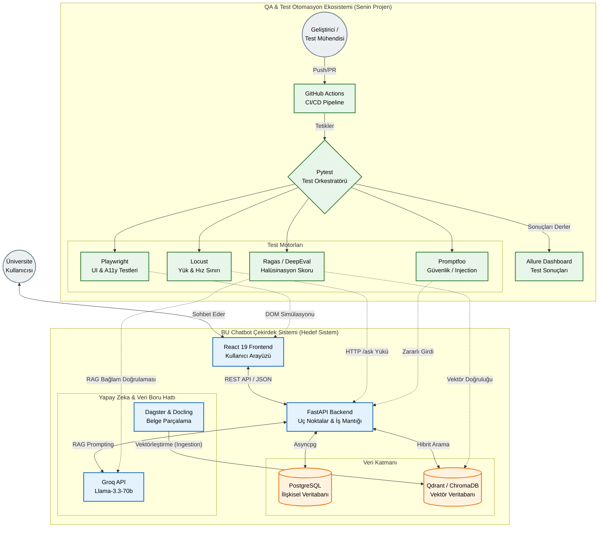

# BU Chatbot - Test Otomasyonu

Bu depo, "BU Chatbot" sisteminin uçtan uca (E2E), API, performans ve Yapay Zeka (LLM) doğruluk metriklerinin test edilmesi için kurulmuş profesyonel bir test otomasyon altyapısıdır.

## Kullanılan Teknolojiler

- **Test Orkestratörü:** Pytest (`pytest-asyncio`)
- **Arayüz (E2E) Testleri:** Playwright
- **Performans Testleri:** Locust
- **Yapay Zeka (RAG) Testleri:** Ragas & Promptfoo
- **Raporlama:** Allure Report

## Kurulum ve Çalıştırma (Kurulum Kılavuzu)

Projeyi kendi bilgisayarınızda çalıştırmak için aşağıdaki adımları izleyin:

1. **Sanal Ortamı Oluşturun ve Aktif Edin:**
   python -m venv venv
   .\venv\Scripts\activate # Windows için

2. **Gerekli Test Kütüphanelerini İndirin:**
   pip install -r requirements.txt

3. **Testleri Başlatın:**
   pytest -v

## Sistem Genel Mimarisi

